## Háttér és motiváció

A problémakör egy gyakorlati alkalmazásban merült fel, amiben egy nagyon zajos és komplex nemlineáris, azonban valamelyest periodikus jelet kellett előrejelezni egy viszonylag hosszú időtávra. Intuitíven úgy tűnt, hogy a háttérben álló differenciálegyenletre való visszavezetés lenne a legjobb megoldás, amely kiértékelése megadja a jövőbeli értékeket (ez a rekurzív előrejelzés). Ennek a megközelítésnek az a motivációja, hogy lényegében egy differenciálegyenletet próbál megtanulni a modell, amely generálja a jelet. Ilyen módon nem csak pontos illeszkedést lehet elérni bizonyos esetekben, hanem jól magyarázható modelleket is kapunk [@Egan2024]. Ez a következő formát öltené:

$$
\begin{aligned}
\dot{x}\left(t\right) \approx x\left(t + \Delta t\right) - x\left(t\right) =&\ f\left(x\left(t\right), x\left(t - \Delta t\right), \ldots, x\left(t - n \cdot \Delta t\right)\right) \\
&+ \epsilon\left(t + \Delta t\right) + \mathcal{O}(\Delta t) \\
\implies x\left(t + m \cdot \Delta t\right) =&\ x\left(t\right) \\
&+ \sum_{i=0}^{m-1} \biggl( f\left(x\left(t + i \cdot \Delta t\right), x\left(t + (i - 1) \cdot \Delta t\right), \ldots, x\left(t + (i - n) \cdot \Delta t\right)\right) \\
&\quad + \epsilon_\text{rekurzív}\left(t + m \cdot \Delta t\right) \biggr) \\
=&\ x\left(t\right) \\
&+ \sum_{i=0}^{m-1} f\bigl(x\left(t + i \cdot \Delta t\right), x\left(t + (i - 1) \cdot \Delta t\right), \ldots, x\left(t + (i - n) \cdot \Delta t\right)\bigr) \\
&+ \sum_{i=0}^{m-1} \epsilon_\text{rekurzív}\left(t + m \cdot \Delta t\right)
\end{aligned}
$$

Ahogy az jól látszik, hogy a $\epsilon_\text{rekurzív}\left(t + \Delta t\right)$ hibák akkumulálódnak, így minél távolabbra szeretnénk előrejelezni, annál nagyobb hibával kell számolnunk.

Egy másik megközelítés, amelyet a gyakorlatban gyakran használnak, az egylépéses előrejelzés, amely a következő formát ölti:

$$
\begin{aligned}
x\left(t + m \cdot \Delta t\right) &= f\left(x\left(t\right), x\left(t - \Delta t\right), \ldots, x\left(t - n \cdot \Delta t\right)\right) + \epsilon_\text{egylépéses}\left(t + m \cdot \Delta t\right)
\end{aligned}
$$

Ezen megközelítésnek az az előnye, hogy a hibája nem akkumulálódik, azonban egy nehezebb feladatot old meg, így a hibája általában nagyobb ($\epsilon_\text{egylépéses}\left(t + m \cdot \Delta t\right) > \epsilon_\text{rekurzív}\left(t + m \cdot \Delta t\right)$). Ennek ellenére képes pontosabb előrejelzést adni, mivel a rekurzív előrejelzés hibája felhalmozódik, míg az egylépéses előrejelzés hibája nem:

$$
\text{az egylépéses modell jobb} \iff \epsilon_\text{egylépéses}\left(t + m \cdot \Delta t\right) < \sum_{i=0}^{m-1} \epsilon_\text{rekurzív}\left(t + m \cdot \Delta t\right)
$$

## A vizsgált idősor

A vizsgált idősor egy szint etikus, periodikus jel, amelyet a következő képlettel definiálunk:

$$
\begin{aligned}
x\left(t\right) &= \sin(a \cdot t + b) \cdot \sin(c \cdot t) + \rho\left(t\right) + \epsilon\left(t\right), \\
s.t. \:\: \rho\left(t\right) &= \overset{N}{\underset{i=1}{\sum}} \nu_i \sin(2\pi \cdot i \cdot f_\text{base} \cdot t + \phi_i), \\
\epsilon\left(t\right) &\sim \mathcal{N} \left(0, \sigma^2\right)
\end{aligned}
$$

A jel egy nemlineáris, periodikus determinisztikus rész, egy periodikus interferáló zaj, és egy fehér zaj összegéből áll. Az interferáló jelet úgy állítottuk össze, hogy egy adott $f_\text{base}$ alapfrekvenciát, valamint annak felharmonikusait tartalmazza. Ez jól közelíti a valós életben előforduló periodikus zajokat, például az elektromos hálózatokból származó zajokat. A fehér zaj pedig egy normális eloszlású véletlenszerű zaj, amely az érzékelő hibáját hivatott modellezni.

A periodikus jel a következő paraméterekkel definiálható:

- $a$: a periodikus jel egyik komponensének frekvenciája
- $b$: a periodikus jel komponensei közti fáziseltolás
- $c$: a periodikus jel másik komponensének frekvenciája

Az interferáló zaj a következő paraméterekkel definiálható:

- $N$: az interferáló zaj komponenseinek száma
- $\nu_i$: az interferáló zaj komponenseinek amplitúdója
- $f_\text{base}$: az interferáló zaj komponenseinek alapfrekvenciája
- $\phi_i$: az interferáló zaj komponenseinek fáziseltolása

A fehér zaj a következő paraméterekkel definiálható:

- $\sigma$: a fehér zaj szórása

### Miért szintetikus jel?

A feladat során vizsgált idősor egy általunk konstruált, szintetikus jel, melyet azért választottunk, hogy tetszőlegesen hosszú jelet tudjunk generálni, hogy kedvünk szerint állíthassuk a zajokat, illetve a megfigyelési frekvenciát. Mindemellett talán a legfontosabb, hogy a kiértékelésnél így össze tudjuk hasonlítani a tiszta jellel, így a lehető legpontosabb képet kapva a modellek teljesítményéről. Ezzel szemben egy valós idősor bekorlátozna bennünket, hiszen nem tudnánk tetszőlegesen hosszú jelet generálni, és a zajok is adottak lennének. A szintetikus jel segítségével így nagy szabadságot ad, amellyel a különböző kísérletek során éltünk is.

## A tanuló modellek

Mindkét megközelítéshez (rekurzív és egylépéses előrejelzés) egyaránt egy 1d konvolúciós neurális hálózatot használtunk, amely a következőképpen van felépítve:

- **Bemenet**: a bemenet egy $n$ hosszúságú ablak, amely az előző $n$ időpont értékeit tartalmazza.
- **1D konvolúciós réteg**: a bemenetet egy 1d konvolúciós rétegen keresztül továbbítjuk, amely $k$ szűrőt használ, és a kimenet mérete $n - k + 1$ lesz.
- **Aktivációs függvény**: a konvolúciós réteg kimenetét egy $\tanh$ aktivációs függvényen keresztül továbbítjuk, amely normalizálja a kimenetet, és segít a nemlineáris kapcsolatok modellezésében.
- **Laposító réteg**: a konvolúciós réteg kimenetét egy laposító rétegen keresztül továbbítjuk, amely a kimenetet egy vektorba alakítja.
- **Teljesen összekötött réteg**: a $\tanh$ aktivációs függvény kimenetét egy teljesen összekötött rétegen keresztül továbbítjuk, amely a kimenetet a kívánt méretre alakítja.
- **Kimenet**: a kimenet egy $m$ hosszúságú vektor, amely az előrejelzett értékeket tartalmazza.

Az 1d konvolúciós réteg jól rá tud tanulni a periodikus és nemlineáris kapcsolatokra [@8682194] (trend nélküli idősorok esetén), és képes kezelni a zajos adatokat is, így jól alkalmazható a feladat megoldására. 

A megvalósítás az alábbi módon történik[^1]:

```python
class Conv1DNN(nn.Module):
    def __init__(self, input_size, hidden_size, output_size, kernel_size):
        super(Conv1DNN, self).__init__()
        self.conv1 = nn.Conv1d(1, hidden_size, kernel_size)
        self.tanh = nn.Tanh()
        self.fc = nn.Linear(hidden_size * (input_size - kernel_size + 1), output_size)

    def forward(self, x):
        x = x.unsqueeze(1)
        x = self.conv1(x)
        x = self.tanh(x)
        x = x.view(x.size(0), -1)
        x = self.fc(x)
        return x
```

[^1]: A kódot saját implementációként mutatjuk be, de a PyTorch dokumentációja és példái alapján készült. Lásd: [PyTorch Conv1d dokumentáció](https://pytorch.org/docs/stable/generated/torch.nn.Conv1d.html).

### Hiperparaméterek megválaszása

A kísérletek során korán világossá vált, hogy mindkét megközelítés esetén nagy mértékben függ a modell teljesítménye a hiperparaméterek beállításától. A hiperparaméterek közé tartozik a konvolúciós réteg szűrőinek száma, a tanulási ráta, az ablak mérete, a teljesen összekötött réteg mérete és a tanulási ciklusok (epoch-ok) száma.

Megválasztásuk először pár manuális próbálkozással kezdődött, amellyel felmértük, hogy mely paraméter milyen tartományban működik jól. Ezt követően egy rácskereséses módszert alkalmaztunk, amelyben a hiperparaméterek különböző kombinációit teszteltük, és a legjobb teljesítményt nyújtó kombinációt választottuk ki.

## Megvalósítás

A kódot tartalmazó jegyzetfüzetet [itt](https://colab.research.google.com/drive/1vbjXEjMGOJvdmeCx64Wp0zAvEwHeoLsO#scrollTo=KY0a9gzobvrV) lehet elérni. A megvalósítás során erősen építettünk a `pytorch` könyvtárra, amely lehetővé teszi a neurális hálózatok egyszerű és hatékony megvalósítását. A kiértékeléshez a `permetrics` könyvtárat használtuk, amely segít az idősorok előrejelzésének kiértékelésében. A kirajzoláshoz pedig a `matplotlib` és `seaborn` könyvtárakat használtuk, amelyek lehetővé teszik a vizualizációk egyszerű és szép elkészítését.

## Kísérletek

A kísérletek során minden esetben alkalmazva voltak a következő paraméterek:

| Paraméter         | Érték         |
|-------------------|--------------|
| $a$               | $0.12123123$ |
| $b$               | $2.132123$   |
| $c$               | $5$          |
| $\sigma$          | $0.1$        |
| $f_\text{base}$   | $5$          |
| $f_s$             | $2$          |

Utóbbi ($f_s$) a megfigyelési frekvencia, amely a jel mintavételezésének gyakoriságát határozza meg.

A generált jel 700 másodperc hosszú, amelyből az első 40%-ot tanulásra, 10%-ot validációra, és a maradék 50%-ot tesztelésre használtuk. Fontos megjegyezni, hogy mindenhol a zajos jelet használtuk, kivéve a tesztelésnél a kiértékeléshez; ezzel mimikálva a valós életben előforduló helyzeteket (ahol nem áll rendelkezésre a tiszta jel, azonban a modell helyességét a tiszta jelhez viszonyított hibája határozza meg).

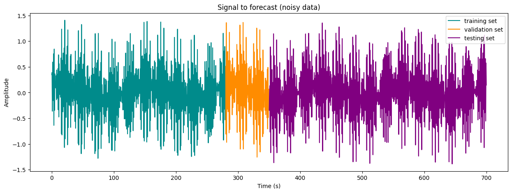{#fig:wave_partitioning}

### Az eredmények kiértékelése

Az egyes modellek tanítását (hiperparaéterek optimalizációjával) követően a teljes teszt adathalmazon kiértékeltük (minden olyan ablakon, amely a visszatekintési ablakot figyelembe véve belefér a tesztelési adathalmazba) a modellek teljesítményét. Minden modell minden előrejezési horizonton ki volt értékelve [három pontossági metrika](#a-pontossági-metrikák) szerint is. Így minden előrejelzési horizonthoz kapunk egy eloszlást. Minket ebből a kétdimenziós eloszlásból az utolsó időpillanathoz (maximális előrejelzési horizonthoz) tartozó eloszlások fontosak, illetve az előrejelzési horizont függvényében a metrikák átlaga és 95%-os konfidencia intervalluma.

Az utolsó időpillanathoz tartozó eloszlásokra egy Mann-Whitney U tesztet [@mcknight2010mann] hajtottunk végre, amely megmutatja, hogy a két eloszlás statisztikailag szignifikánsan különbözik-e egymástól. A próba megválasztása mögötti indoklás az, hogy a pontossági metrikák eloszlása nem normális, így a paraméteres tesztek nem alkalmazhatóak. A Mann-Whitney U teszt egy nem-paraméteres teszt, amely képes összehasonlítani két eloszlás középső értékét, és megmondani, hogy szignifikánsan különböznek-e egymástól. Továbbá fontos volt, hogy képes legyen különböző méretű minták összehasonlítására is, mivel a visszatekintési ablak mérete változhatott a különböző modellek esetén.

### A pontossági metrikák

#### Determinisztikus együttható ($R^2$)

$$
R^2 = 1 - \frac{\sum_{i=1}^{n} (y_i - \hat{y}_i)^2}{\sum_{i=1}^{n} (y_i - \bar{y})^2}
$$

#### Átlagos Arkusztangens Abszolút Százalékos Hiba (MAAPE)

$$
\text{MAAPE} = \frac{1}{n} \sum_{i=1}^{n} \left| \frac{\arctan(y_i) - \arctan(\hat{y}_i)}{\arctan(y_i)} \right| \cdot 100
$$

#### Normalizált Gyökös Középérték Négyzetes Hiba (NRMSE)

$$
\text{NRMSE} = \sqrt{\frac{\frac{1}{n} \sum_{i=1}^{n} (y_i - \hat{y}_i)^2}{\text{var}\left(y\right)}}
$$

### Alapeset (baseline)

**A vizsgált jel paraméterei:**

| Paraméter         | Érték        |
|-------------------|--------------|
| $N$               | $8$          |
| $\nu_i$           | $e^{-i}$     |
| $\phi_i$          | $\frac{i}{2}$|


#### Eredmények \newline

A multi-step modell eredményei:

| Statisztika / Metrika |     R²     |   MAAPE    |   NRMSE    |
|:----------------------|:----------:|:----------:|:----------:|
| Átlag                 | 0.861215   | 0.533088   | 0.389559   |
| Szórás                | 0.064623   | 0.109054   | 0.121122   |
| Minimum               | 0.760632   | 0.175470   | 0.100543   |
| 25%                   | 0.811130   | 0.493208   | 0.315494   |
| 50% (Medián)          | 0.839164   | 0.574209   | 0.438298   |
| 75%                   | 0.908922   | 0.607534   | 0.477222   |
| Maximum               | 0.990334   | 0.668871   | 0.546258   |


A single-step modell eredményei:

| Statisztika / Metrika |     R²     |   MAAPE    |   NRMSE    |
|:----------------------|:----------:|:----------:|:----------:|
| Átlag                 | 0.748613   | 0.605215   | 0.563616   |
| Szórás                | 0.109455   | 0.089643   | 0.158023   |
| Minimum               | 0.450480   | 0.345066   | 0.285388   |
| 25%                   | 0.677587   | 0.547901   | 0.467984   |
| 50% (Medián)          | 0.776785   | 0.640956   | 0.530587   |
| 75%                   | 0.815945   | 0.670578   | 0.680598   |
| Maximum               | 0.924577   | 0.732448   | 0.958992   |


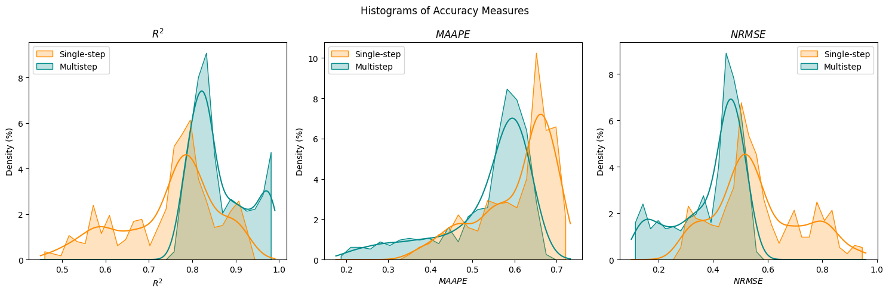{#fig:baseline_hisograms}

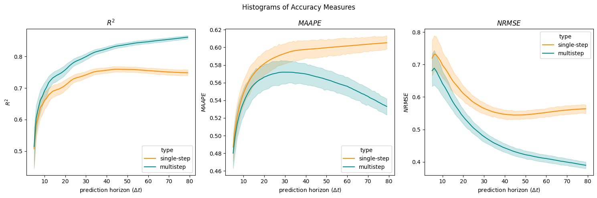{#fig:baseline_metrics_over_horizon}

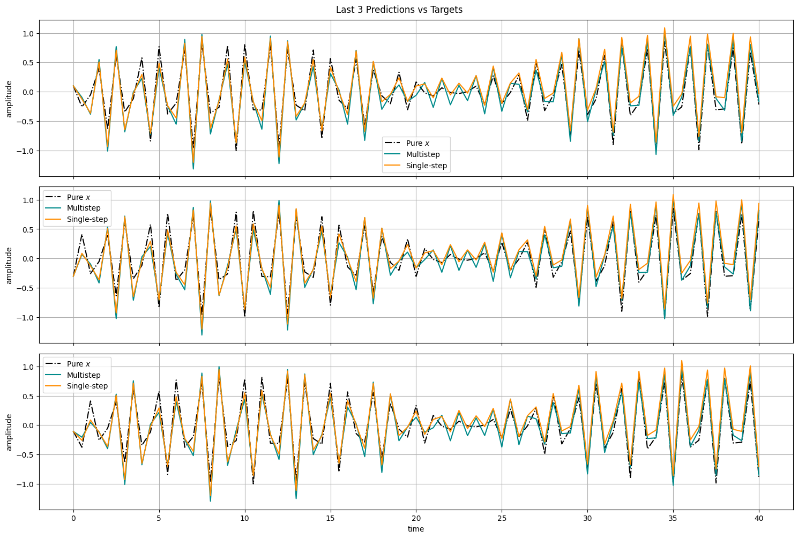{#fig:baseline_targets}


### Konstans amplitúdójú felharmonikusok

**A vizsgált jel paraméterei:**

| Paraméter         | Érték         |
|-------------------|--------------|
| $N$               | $8$          |
| $\nu_i$           | $0.05$     |
| $\phi_i$          | $0.5*i$          |

#### Eredmények \newline

A multi-step modell eredményei:

| Statisztika / Metrika |     R²     |   MAAPE    |   NRMSE    |
|:----------------------|:----------:|:----------:|:----------:|
| Átlag                 | 0.996012   | 0.155957   | 0.060017   |
| Szórás                | 0.002521   | 0.039808   | 0.018727   |
| Minimum               | 0.987715   | 0.059417   | 0.029973   |
| 25%                   | 0.994496   | 0.124806   | 0.044415   |
| 50% (Medián)          | 0.997040   | 0.152023   | 0.054228   |
| 75%                   | 0.998013   | 0.185046   | 0.073972   |
| Maximum               | 0.999098   | 0.262619   | 0.110965   |

A single-step modell eredményei: 

| Statisztika / Metrika |     R²     |   MAAPE    |   NRMSE    |
|:----------------------|:----------:|:----------:|:----------:|
| Átlag                 | 0.956486   | 0.292970   | 0.175567   |
| Szórás                | 0.009180   | 0.033163   | 0.015822   |
| Minimum               | 0.932472   | 0.216166   | 0.141025   |
| 25%                   | 0.948622   | 0.269446   | 0.161697   |
| 50% (Medián)          | 0.956709   | 0.289023   | 0.176190   |
| 75%                   | 0.964651   | 0.313658   | 0.189437   |
| Maximum               | 0.974404   | 0.388278   | 0.211980   |

Mindkét modell teljesítménye javulást mutatott az előző állapothoz képest, azonban a multistep modell jelentősen jobb eredményeket ért el, egyértelműen felülmúlva a single-step megközelítést.

{#fig:constant_amplitude_hisograms}

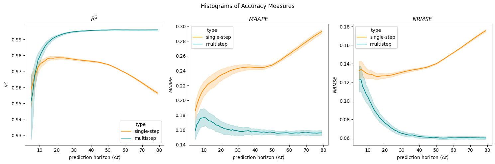{#fig:constant_amplitude_metrics_over_horizon}

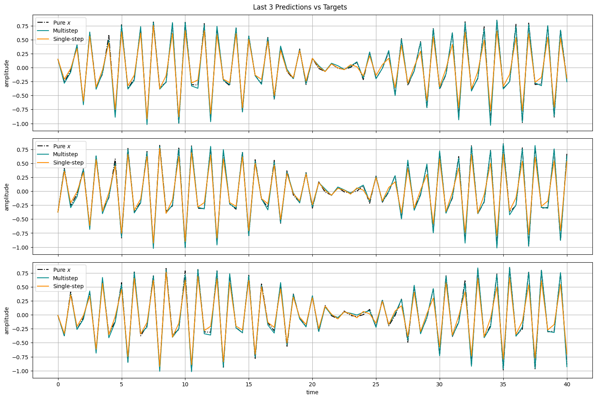{#fig:constant_amplitude_targets}

### Azonos fázisú felharmonikusok

**A vizsgált jel paraméterei:**

| Paraméter         | Érték         |
|-------------------|--------------|
| $N$               | $8$          |
| $\nu_i$           | $e^{-i}$     |
| $\phi_i$          | $0$          |

#### Eredmények \newline

A multi-step modell eredményei:

| Statisztika / Metrika |     R²     |   MAAPE    |   NRMSE    |
|:----------------------|:----------:|:----------:|:----------:|
| Átlag                 | 0.824305   | 0.582514   | 0.452977   |
| Szórás                | 0.069269   | 0.119868   | 0.123881   |
| Minimum               | 0.727687   | 0.190561   | 0.134771   |
| 25%                   | 0.772817   | 0.542082   | 0.390751   |
| 50% (Medián)          | 0.796647   | 0.633729   | 0.502453   |
| 75%                   | 0.868249   | 0.663283   | 0.540860   |
| Maximum               | 0.982459   | 0.715664   | 0.614921   |

A single-step modell eredményei:

| Statisztika / Metrika |     R²     |   MAAPE    |   NRMSE    |
|:----------------------|:----------:|:----------:|:----------:|
| Átlag                 | 0.804158   | 0.541396   | 0.482865   |
| Szórás                | 0.087801   | 0.107451   | 0.133974   |
| Minimum               | 0.594845   | 0.270309   | 0.219784   |
| 25%                   | 0.749299   | 0.467209   | 0.400087   |
| 50% (Medián)          | 0.816612   | 0.560052   | 0.468941   |
| 75%                   | 0.859210   | 0.628328   | 0.571633   |
| Maximum               | 0.955980   | 0.712459   | 0.782898   |

A két modell teljesítménye annyira hasonló volt, hogy a MAAPE mutató esetében a különbség statisztikailag nem szignifikánsnak bizonyult (Mann–Whitney U teszt alapján).
A multistep modell pontossága nem javult érdemben az alaphelyzethez képest, míg a single-step modell esetében enyhe teljesítménynövekedés figyelhető meg.

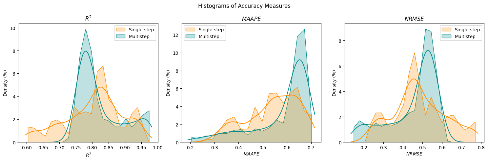{#fig:constant_phase_hisograms}

{#fig:constant_phase_metrics_over_horizon}

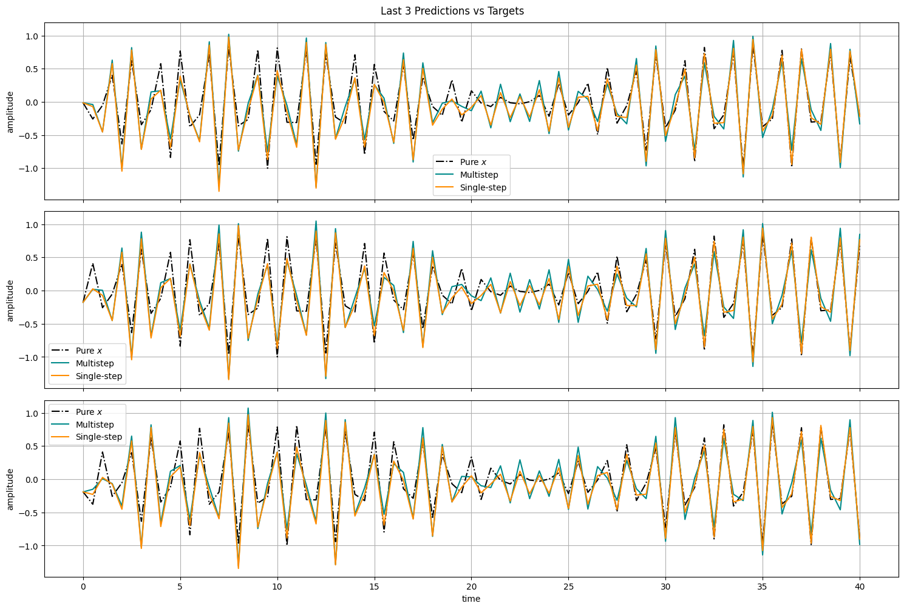{#fig:constant_phase_targets}

### Azonos fázisú, azonos amplitúdójú felharmonikusok

**A vizsgált jel paraméterei:**

| Paraméter         | Érték         |
|-------------------|--------------|
| $N$               | $8$          |
| $\nu_i$           | $0.05$     |
| $\phi_i$          | $0$          |

#### Eredmények \newline

A multi-step modell eredményei: 

| Statisztika / Metrika |     R²     |   MAAPE    |   NRMSE    |
|:----------------------|:----------:|:----------:|:----------:|
| Átlag                 | 0.996943   | 0.141795   | 0.052993   |
| Szórás                | 0.001832   | 0.038001   | 0.015380   |
| Minimum               | 0.990254   | 0.063674   | 0.029800   |
| 25%                   | 0.995883   | 0.114157   | 0.040606   |
| 50% (Medián)          | 0.997641   | 0.136857   | 0.048513   |
| 75%                   | 0.998355   | 0.166824   | 0.064159   |
| Maximum               | 0.999107   | 0.258390   | 0.097862   |

A singe-step modell eredményei:

| Statisztika / Metrika |     R²     |   MAAPE    |   NRMSE    |
|:----------------------|:----------:|:----------:|:----------:|
| Átlag                 | 0.983068   | 0.268878   | 0.124674   |
| Szórás                | 0.008837   | 0.045244   | 0.031973   |
| Minimum               | 0.955019   | 0.180249   | 0.080115   |
| 25%                   | 0.977305   | 0.238641   | 0.098538   |
| 50% (Medián)          | 0.985808   | 0.258839   | 0.116803   |
| 75%                   | 0.990101   | 0.296830   | 0.149235   |
| Maximum               | 0.993446   | 0.417857   | 0.211316   |

Mindkét modell teljesítménye javulást mutatott az alapállapothoz képest, azonban a multistep modell jelentősen jobb eredményeket ért el, egyértelműen felülmúlva a single-step megközelítést.

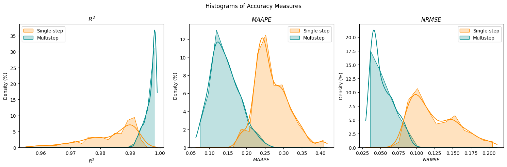{#fig:constant_phase_constant_amplitude_hisograms}

{#fig:constant_phase_constant_amplitude_metrics_over_horizon}

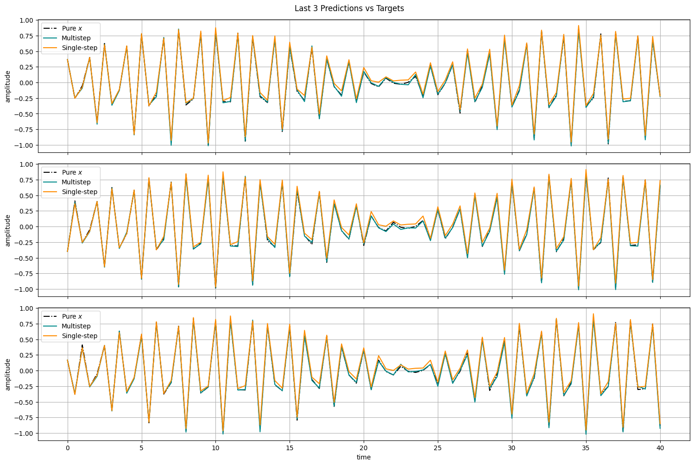{#fig:constant_phase_constant_amplitude_targets}

### Sok felharmonikus

**A vizsgált jel paraméterei:**

| Paraméter         | Érték         |
|-------------------|--------------|
| $N$               | $1000$          |
| $\nu_i$           | $e^{-i}$     |
| $\phi_i$          | $\frac{i}{2}$          |

#### Eredmények \newline

A multi-step modell eredményei:

| Statisztika / Metrika |     R²     |   MAAPE    |   NRMSE    |
|:----------------------|:----------:|:----------:|:----------:|
| Átlag                 | 0.847434   | 0.545867   | 0.416204   |
| Szórás                | 0.062518   | 0.109039   | 0.115635   |
| Minimum               | 0.767075   | 0.233465   | 0.133130   |
| 25%                   | 0.800567   | 0.502339   | 0.362277   |
| 50% (Medián)          | 0.820599   | 0.592896   | 0.468674   |
| 75%                   | 0.884667   | 0.618499   | 0.500377   |
| Maximum               | 0.983496   | 0.671836   | 0.539017   |

A single-step modell eredményei:

| Statisztika / Metrika |     R²     |   MAAPE    |   NRMSE    |
|:----------------------|:----------:|:----------:|:----------:|
| Átlag                 | 0.776035   | 0.576163   | 0.528561   |
| Szórás                | 0.104149   | 0.120279   | 0.168768   |
| Minimum               | 0.533675   | 0.249557   | 0.193142   |
| 25%                   | 0.707580   | 0.508881   | 0.415826   |
| 50% (Medián)          | 0.774476   | 0.615958   | 0.534799   |
| 75%                   | 0.848639   | 0.666859   | 0.654348   |
| Maximum               | 0.965065   | 0.737749   | 0.880469   |

A single-step modell egy kisit, a hisztogramokon alig látható mértékben erősödött. 
Ezzel szemben a multistep modell predikciós pontossága romlott: az előnye minimálisra csökkent, bár az R² és NRMSE mutatók alapján a különbség még mindig statisztikailag szignifikáns.
Fontos megjegyezni, hogy MAAPE alapján a multistep modell kifejezetten gyengébben szerepelt.

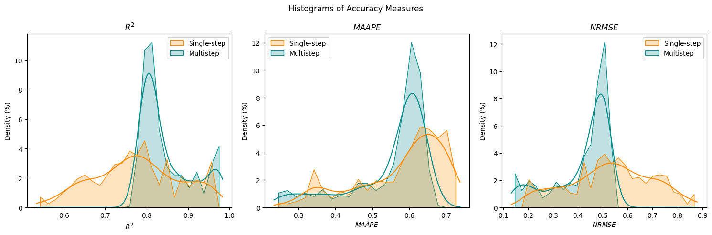{#fig:1000_hisograms}

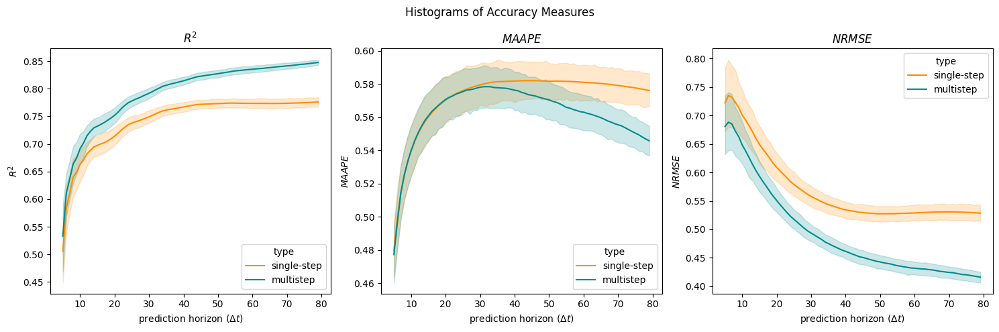{#fig:1000_metrics_over_horizon}

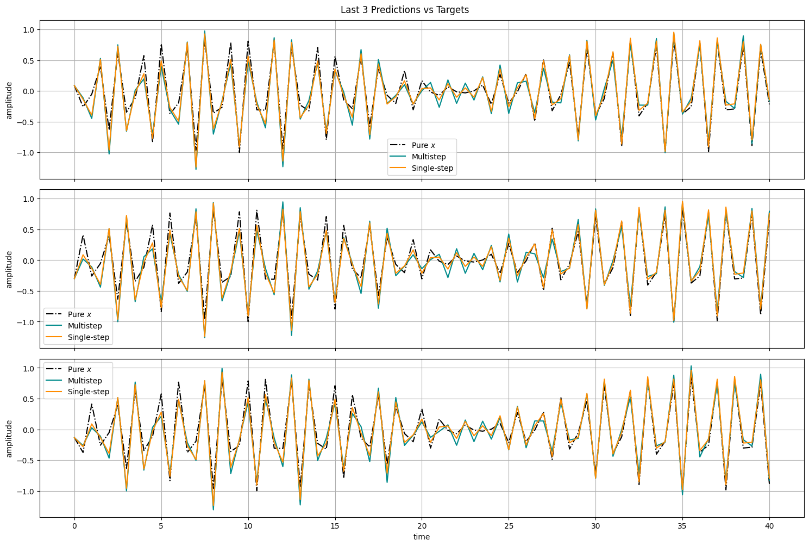{#fig:1000_targets}

## Összefoglalás

A kísérletek során sikerült bemutatni, hogy a rekurzív és egylépéses előrejelzés is képes jól teljesíteni a vizsgált idősor előrejelzésében, azonban legtöbb esetben az egylépéses előrejelzés volt a jobb teljesítményű (különösen a hosszú távú előrejelzésnél). A rekurzív előrejelzés esetén a hibák felhalmozódása miatt a hosszú távú előrejelzés pontossága csökkent, míg az egylépéses előrejelzés esetén a hibák nem halmozódtak fel, így a hosszú távú előrejelzés is pontosabb volt.

### Limitációk

A házi feladat során csupán egy architektúrát vizsgáltunk, egyetlen idősoron. Előfordulhat, hogy más architektúrák vagy idősorok esetén más eredmények születnének. Elképzelhetőek olyan modellek is, amelyek nem tisztán az egyik vagy más megközelítést használják, hanem egyesítik a rekurzív és egylépéses előrejelzést, így kihasználva mindkét megközelítés előnyeit [@taiebrecursive].

## Irodalomgyűjtemény

::: {#bibliography}
:::
